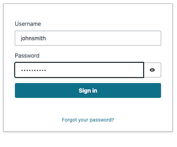
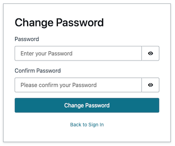

# Gen AI Trivia


## Description
Gen AI Trivia is an interactive trivia application that generates questions and answers using artificial intelligence. It provides an engaging and educational experience for users to test their knowledge across various topics. Gen AI Trivia utilizes advanced natural language processing and machine learning techniques to generate unique and challenging trivia questions. The application consists of a backend API that handles question generation and a user-friendly frontend interface for users to interact with the trivia game.

## Architecture


## Folder Structure

The project's folder structure is organized as follows:

| Folder/File   | Description                                           |
|---------------|-------------------------------------------------------|
| `app/`        | Contains the application's infrastructure code that will be built and transformed within the CI/CD pipeline. |
| `configs/`    | Contains the application's deployment configurations. |
| `images/`     | Contains the images used within the README file.      |
| `pipeline/`   | Contains the application's infrastructure code for the CI/CD pipeline. |
| `res/electron/` | Contains the application's Electron settings file.  |
| `scripts/`    | Contains the scripts used to update configurations for the application. |
| `www/`        | Contains the frontend code and related files.         |
| `requirements.txt` | Pip requirements file for the deployment environment. |
| `README.md`   | The main README file for the project.                  |
| `CONTRIBUTING.md` | Guidelines for contributing to the project.         |
| `FAQ.md`      | Frequently asked questions and their answers.          |
| `LICENSE`     | The license file for the project.                      |

## Prerequisites

Before installing and running Gen AI Trivia, ensure that you have the following prerequisites:

- Node.js (version 14 or higher)

- NPM (version 6 or higher)

- Python / Pip (version 3.9 or higher)

- [AWS CloudFormation Development Kit (CDK)](https://docs.aws.amazon.com/cdk/v2/guide/getting_started.html#getting_started_install)

- AWS account with necessary permissions

- [AWS CLI installed](https://docs.aws.amazon.com/cli/latest/userguide/getting-started-install.html) and [configured](https://docs.aws.amazon.com/cli/latest/userguide/getting-started-quickstart.html)

## Installation and Setup

Note: This solution can only be used in AWS Regions that have access to the Amazon Bedrock Claude 3 Sonnet model.

### Get access to Amazon Bedrock Claude 3 Sonnet Model

The Gen AI Trivia solution uses the Amazon Bedrock Claude 3 Sonnet model as the method to generate the topic questions.

1. Navigate to the Amazon Bedrock Service. 

   

2. Click on "Get started".

   

3. If this is your first time using Amazon Bedrock, you will receive a welcome message. From there, click on "Manage model access".

   

4. Once on the Model access page, click on "Enable specific models".

   

5. Scroll down to the "Anthropic" section and click on the box next to the "Claude 3 Sonnet" model. Scroll down to the bottom of the page and click "Next". 

   

6. Review that you've selected the correct model and click "Submit".

   

7. Once the model access request has been submitted, it should be approved. To verify it was approved, navigate back to the "Model access" page and ensure you see an "Access granted" text next to the requested model.

   

### Deploy CI/CD Pipeline

The Gen AI Trivia code will deploy a CI/CD Pipeline that will deploy the Gen AI Trivia application. To install and set up the Gen AI Trivia Pipeline, follow these steps:

1. Clone the repository.

   ```bash
   git clone https://github.com/aws-samples/gen-ai-trivia.git
   ```

2. Navigate to the project directory.

   ```bash
   cd gen-ai-trivia
   ```

3. Install Python dependencies.

   ```bash
   pip install -r requirements.txt
   ```

4. Ensure you have access to an AWS Account.

5. Create initial CDK Bootstrap dependencies, then generate AWS CloudFormation Code and finally deploy the generated code.

   ```bash
   cdk bootstrap
   cdk synth gen-ai-trivia-pipeline
   cdk deploy gen-ai-trivia-pipeline --require-approval never
   ```

   After the code has run successfully, the CI/CD pipeline should automatically start. It will use an AWS CodeCommit repository that the solution creates. Once the pipeline completes, continue to the next step. The pipeline will create 3 AWS CloudFormation stacks (_gen-ai-trivia-pipeline_, _gen-ai-trivia-application_, and _gen-ai-trivia-s3-artifact-deployment_).

   

6. Add users to the Amazon Cognito User Pool.

   a. Navigate to the Amazon Cognito service.

   

   b. Ensure you're in the "User pools" section and select the generated user pool.

   

   c. Ensure you're in the "Users" section and click on "Create user".

   

   d. Select "Send an email invitation", enter in the desired "User name", enter an email address you have access to, select "Mark email address as verified", and select "Generate a password". Doing the following will generate an email with a password for the first time you log in.  

   


7. Once the deployment is complete, access the application using the provided URL. The URL can be found in the "Outputs" tab of the AWS CloudFormation stack "_gen-ai-trivia-application_". 

   

   Or run the following command to get the URL:

   ```bash
   aws cloudformation describe-stacks --stack-name "gen-ai-trivia-application" --query 'Stacks[*].Outputs[?OutputKey==`oTerraformBucket`].OutputValue' --output text
   ```

8. Navigate to and log in to the URL from step 7. Use the email with the generated password from step 5 to log in. Once you are logged in, you will be prompted to change the password.

      

9. Work hard. Have fun. Make history.

   

## Uninstall Solution

1. To remove the AWS CloudFormation Stacks along with the AWS Resources they create, run the following commands:

   ```bash
   cdk destroy gen-ai-trivia-s3-artifact-deployment --force
   aws cloudformation delete-stack --stack-name gen-ai-trivia-application
   aws cloudformation wait stack-delete-complete --stack-name gen-ai-trivia-application
   cdk destroy gen-ai-trivia-pipeline --force
   ```

## Contributing

We welcome contributions to improve the Gen AI Trivia project. Please refer to the [CONTRIBUTING.md](CONTRIBUTING.md) file for detailed guidelines on how to contribute.

## FAQ

For common issues and their resolutions, please refer to the [FAQ.md](FAQ.md) file.

## License

This project is licensed under the [MIT License](LICENSE).
